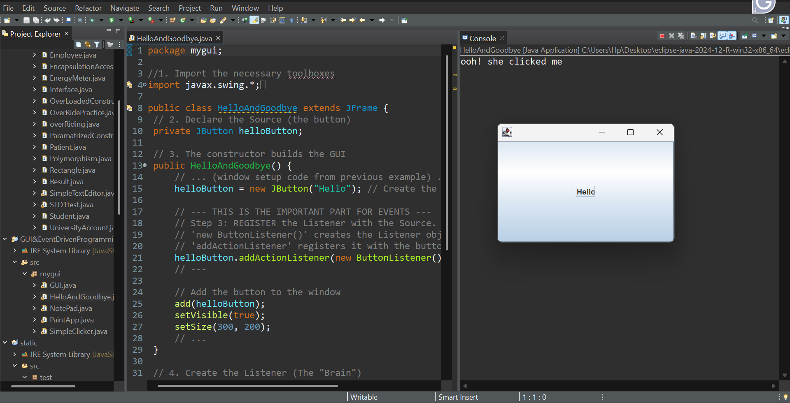

# ☕ Java Event-Driven GUI Programming

> Building interactive Java GUIs using Swing — learning how buttons, 
> events, and listeners work together in real-time applications.

---

## 📸 Screenshots

| App | Preview |
|-----|---------|
| Hello Button Event | |

---

## 🧠 Concepts Learned

| Concept | Description |
|---------|-------------|
| `JButton` | Creating clickable buttons in Swing |
| `ActionListener` | Listening for user interactions |
| `addActionListener()` | Registering events with a source |
| Event-Driven Programming | Code that reacts to user actions |

---

## 🗂️ What's Inside

| File | Description |
|------|-------------|
| `HelloAndGoodbye.java` | Button click event — prints to console on click |

---

## 🚀 How to Run

1. Make sure **JDK 8+** is installed
2. Clone the repo:
```bash
   git clone https://github.com/laibaazeem3250-ship-it/java-event-driven-gui.git
```
3. Open in **Eclipse IDE**
4. Run `HelloAndGoodbye.java`
5. Click the **Hello** button and watch the console! 🖱️

---

## 💡 How Event-Driven Programming Works
User clicks button
↓
ActionListener fires
↓
ButtonListener executes
↓
Console prints: "ooh! she clicked me"

------

## 📅 Progress Log

| Date | What I Learned |
|------|----------------|
| April 7, 2025 | JButton, ActionListener, Event Registration |

---

## 🛠️ Tech Stack


---

## 🙋‍♀️ Author

**Laiba Azeem**
🎓 CS Student | Learning Java GUI one click at a time 😄

[](https://github.com/laibaazeem3250-ship-it)

